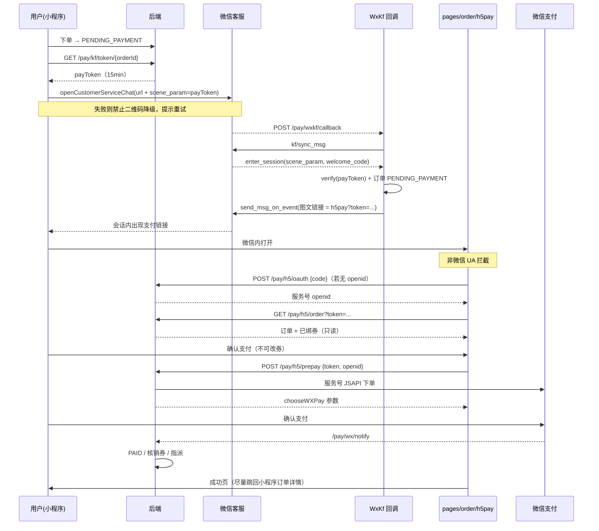

# 客服会话 H5 支付链路设计

> 日期：2026-07-07  
> 修订：2026-07-15（Grill 决议同步）  
> 状态：已按 Grill 决议修订，待最终确认后进入实现计划  
> 范围：小程序支付入口 → 微信客服会话 → 自动推送 H5 支付链接 → 服务号 JSAPI 支付  
> 背景约束：小程序代练支付功能被封禁，需将「小程序内微信支付」改为「联系客服 → 客服自动发 H5 支付链接」。

---

## 0. Grill 决议摘要（实现必须遵循）

| # | 决议 |
|---|---|
| 1 | 小程序**保留余额支付**；仅「微信支付」改为「联系客服」 |
| 2 | H5 **优惠券只读**，禁止改券（与现网一致：券在下单时绑定） |
| 3 | 打手押金本期**不动** |
| 4 | H5 **只做微信支付**，不做余额 |
| 5 | 不加新的 `/pay/wx` 业务开关；沿用已有 `wx.pay.enabled` |
| 6 | 新建独立页 `pages/order/h5pay`；`pay.vue` 只管小程序 |
| 7 | 轻量 `snsapi_base` + `POST /pay/h5/oauth` 换 openid，**不绑用户登录态** |
| 8 | payToken 用紧凑点分串 `orderId.userId.exp.jti.sig`（控制 `scene_param` ≤128） |
| 9 | H5 支付成功页 + 尽量跳回小程序订单详情；失败则文案引导 |
| 10 | `scene=pay` **禁止二维码降级**；打不开客服则提示重试 |
| 11 | 非微信 UA **全屏拦截**，提示在微信中打开 |
| 12 | payToken **不作废（无 consume）**；靠订单状态 `PENDING_PAYMENT` + TTL 防滥用 |

---

## 1. 背景与目标

### 背景

- 小程序因代练服务违规，支付能力被封禁。
- 现状：小程序微信支付走 `PayController.wxPay` → `createWxPayment` → `createPrepayOrder`（小程序 JSAPI）→ `uni.requestPayment`；回调走 `PaymentServiceImpl.handleWxPayV3Notify`。
- 现状：小程序已通过 `useWeworkCs.js` + `wx.openCustomerServiceChat` 实现「联系客服」（配置项 `cs.corp_id`、`cs.service_url` 已存在）。
- 账号现状：
  - **服务号**（认证，与小程序同主体、共用商户号）。
  - **企业微信**（已开通微信客服，可跳转指定客服会话）。
  - **服务号与企业微信不属于同一开放平台主体 → unionid 无法打通。**

### 目标

1. 小程序支付页：微信支付改为「联系客服」；**余额支付保留**。
2. 用户进入客服会话后，**服务器自动**推送 H5 支付链接（机器人，无需人工）。
3. H5 独立支付页：展示订单与已绑优惠券（只读），走**服务号 JSAPI 支付**。
4. 支付成功后复用现有订单状态机（`PENDING_PAYMENT → PAID`）、优惠券核销、自动指派打手。

### 非目标

- 不改动余额支付接口逻辑；小程序支付页**继续展示并支持**余额支付。
- 不改动打手押金支付、退款逻辑（押金仍走小程序 `uni.requestPayment`，若后续也被卡再单开一期）。
- 不依赖 unionid（scene_param 透传）。
- 不做人工客服工作台；不做「用户发订单号触发发链接」。
- H5 不做余额支付、不做改券、不做完整订单详情页。
- 不加新的小程序直付开关（沿用 `wx.pay.enabled`）。

---

## 2. 核心设计原则

**全程用「订单支付 token（payToken）」串联，绕开主体隔离与 unionid。**

企业微信只负责「把带 token 的链接递到用户面前」，真正的钱与订单归属由 payToken 锁定，仍在原服务号 + 商户号体系内。

- payToken = 短时效、HMAC 签名的紧凑字符串，内含 `orderId` / `userId`。
- 谁点开链接谁就为该订单付款，**不要求 H5 付款人 openid 与下单 userId 一致**。
- 安全底座：签名 + TTL + **每次业务操作强校验订单仍为 `PENDING_PAYMENT`**（不作废 jti，见决议 #12）。

---

## 3. 整体架构

| 模块 | 改动类型 | 说明 |
|---|---|---|
| 小程序 `pay.vue` | 小改 | 微信支付 →「联系客服」（带 `scene_param`）；余额支付保留 |
| 后端 · PayTokenService | **新增** | 签发 / 校验紧凑 payToken |
| 后端 · 微信客服回调 (WxKf) | **新增** | `enter_session` → 校验 token → 自动推 H5 链接 |
| 后端 · 支付下单适配 | 改造 | `createPrepayOrder` 参数化 appid + openid；H5 走服务号 |
| H5 · `pages/order/h5pay` | **新增** | 独立页：UA 拦截 / oauth / 只读订单券 / JSSDK 支付 / 成功页 |
| 支付回调 / 核销 / 指派 | **复用** | `handleWxPayV3Notify` 按 `paymentNo` 定位 |

### 模块落点

后端新增包 `com.delta.pay.wxkf`（`delta-pay` 模块下）：

- `WxKfController` — 微信客服回调（URL 验证 + 消息接收）
- `WxKfService` — access_token、`sync_msg`、`send_msg` / `send_msg_on_event`
- `WxKfCrypt` — 企业微信消息加解密
- `PayTokenService` — `com.delta.pay.service`
- `H5PayController` — H5 授权 / 查单 / 预下单 /（可选）JSSDK 签名

---

## 4. 完整链路时序



---

## 5. 详细设计

### 5.1 payToken（PayTokenService）

**结构**（紧凑点分串，满足 `scene_param` URLEncode 后 ≤128）：

```
payToken = orderId + "." + userId + "." + exp + "." + jti + "." + sig
```

- `exp`：Unix 秒级过期时间
- `jti`：8～12 位随机串（非 UUID）
- `sig`：HMAC-SHA256(`orderId.userId.exp.jti`, `pay.kf.token_secret`) 取前 16 字节，再 base64url
- 整体目标长度约 80～110，URLEncode 后仍 < 128

**TTL**：默认 900 秒（`pay.kf.token_ttl_seconds`）。

**Redis（可选加固，推荐保留）**：签发时 `SET pay:kf:token:{jti} = orderId EX ttl`，用于辅助防重放；**不做支付成功后的 consume**（决议 #12）。即使 Redis key 仍在，业务接口必须以订单状态为准。

**校验规则**（任一失败即拒）：

1. 签名合法  
2. 未过期  
3. 若启用 Redis jti：key 存在  
4. 订单存在且状态为 `PENDING_PAYMENT`（**主防线**）

**接口**：

| 方法 | 说明 |
|---|---|
| `String issue(Long orderId, Long userId)` | 签发 |
| `PayTokenPayload verify(String token)` | 校验并返回载荷；失败抛 `BusinessException` |

**不做** `consume(jti)`。

**安全**：`pay.kf.token_secret` 仅服务端配置；同一 `orderId` 每分钟签发限流。

### 5.2 小程序端改动（`pay.vue` + `useWeworkCs`）

- **余额支付**：保留，逻辑不变。
- **微信支付**：改为「联系客服」：
  1. `GET /pay/kf/token/{orderId}` 拿 payToken  
  2. `openWeworkCs({ scene: 'pay', payToken })`  
  3. 客服链接追加 `&scene_param=${encodeURIComponent(payToken)}`
- **`scene=pay` 禁止二维码降级**：`openCustomerServiceChat` 失败 → toast/弹窗「客服暂时不可用，请稍后重试」，可重试；**不弹二维码**（二维码无法透传 scene_param，会导致机器人发不出链接）。
- 其他 scene（`general` / `product` / `complaint`）二维码降级策略不变。

### 5.3 微信客服回调（WxKfController + WxKfService）

**回调地址**：`GET/POST /pay/wxkf/callback`。

**URL 验证（GET）**：`msg_signature, timestamp, nonce, echostr` → 解密 `echostr` 原样返回。

**接收事件（POST）**：

1. 解密 → `Token` + `OpenKfId`  
2. `kf/sync_msg`（cursor 存 Redis：`pay:kf:cursor:{open_kfid}`）  
3. 处理 `enter_session`：
   - 有合法 `scene_param` 且订单 `PENDING_PAYMENT` → `send_msg_on_event` 推图文/链接消息（URL = `{pay.kf.h5_pay_base_url}?token={payToken}`，base_url 指向独立 H5 页真实 path）  
   - 订单已 `PAID` → 文本「该订单已支付，无需重复支付」  
   - `scene_param` 空 / token 非法 → 文本「请回到小程序重新发起支付」  
4. **本期不处理**用户主动发来的文本订单号。

**access_token**：企业微信微信客服 Secret，Redis 缓存 `pay:kf:access_token`（TTL ~7000s，锁刷新）。

**时间窗**：首条优先 `send_msg_on_event`（`welcome_code` 约 20s）；二次进会话 / 超时降级 `kf/send_msg`（48h 规则）。

**幂等**：cursor 去重；同一 token 可重复进会话重复发链接（直到订单非待付或 token 过期）。

### 5.4 H5 支付页（独立页 `pages/order/h5pay`）

**现状**：uni-app 可编 H5，但微信支付**未接入**（`pay.vue` 中 `canUseWechatPay = isMpWeixin()`，H5 直接 toast「暂未接入」）。`uni.requestPayment` 不可用于 H5。

**页面职责**（新建，不污染小程序 `pay.vue`）：

1. **非微信 UA**：全屏拦截「请在微信中打开此链接完成支付」，不请求后端。  
2. **微信内**：若无 openid → `snsapi_base`（`state=payToken`）→ 回调回本页 → `POST /pay/h5/oauth` 换 openid，存 `sessionStorage`。  
3. `GET /pay/h5/order?token=` 展示订单金额、商品名、**已绑定优惠券（只读）**。  
4. 仅「微信支付」按钮 → `POST /pay/h5/prepay` → `wx.config`（如需）+ `wx.chooseWXPay`。  
5. **成功页**：展示成功信息；优先尝试跳回小程序订单详情；失败则文案「请返回微信小程序查看订单」。

**不做**：余额入口、改券、完整订单详情。

**后端契约**：

| 方法 | 入参 | 出参 | 说明 |
|---|---|---|---|
| `POST /pay/h5/oauth` | `code` | `{ openid }` | 服务端用 `wx.mp.secret` 换服务号 openid |
| `GET /pay/h5/order` | `token` | 订单详情 + 已绑券信息（只读） | verify + `PENDING_PAYMENT` |
| `POST /pay/h5/prepay` | `token`, `openid` | `chooseWXPay` 参数 | **不接受** userCouponId；金额以下单绑券为准 |
| `GET /pay/h5/jsconfig`（建议） | `url` | `wx.config` 签名参数 | JSSDK 初始化 |

- `/pay/h5/prepay`：`verify(token)` → 订单必须 `PENDING_PAYMENT` → `createWxPayment(orderId, userId)` → 服务号 appid + 入参 openid 调 `createPrepayOrder`，`pay_channel=MP_H5`。  
- 支付成功核销仍走现有回调里的 `markCouponUsed`（下单时已绑 `userCouponId`）。

### 5.5 支付下单适配

- `WxPayConfiguration` / 配置增加 `wx.mp.appid`、`wx.mp.secret`。  
- `createPrepayOrder` **参数化** `appid` + `openid`：
  - 小程序路径（若仍调用 `/pay/wx`）：小程序 appid + 小程序 openid  
  - H5：服务号 appid + 服务号 openid  
- `Payment.pay_channel`：`MINIAPP` / `MP_H5`（nullable）。  
- `notify_url` 共用；`handleWxPayV3Notify` **无需为 consume 改动**。  
- `/pay/wx/{orderId}` **保留**，沿用 `wx.pay.enabled`；新小程序支付页**不再调用**它。

> 上线前：服务号 appid 必须在商户平台完成 APPID 绑定。

---

## 6. 配置项

复用 `sys_config` 或 `application.yml`（实现时二选一并写清，建议敏感项放 yml）：

| key | 说明 |
|---|---|
| `pay.kf.token_secret` | payToken HMAC 密钥 |
| `pay.kf.token_ttl_seconds` | 默认 900 |
| `pay.kf.h5_pay_base_url` | H5 页完整基址，如 `https://pay.example.com/#/pages/order/h5pay` |
| `wx.mp.appid` | 服务号 appid |
| `wx.mp.secret` | 服务号 Secret |
| `wx.kf.corp-id` | 企业微信 corpId |
| `wx.kf.secret` | 微信客服 Secret |
| `wx.kf.callback-token` | 回调 Token |
| `wx.kf.callback-aes-key` | 回调 EncodingAESKey |

已有、沿用：`wx.pay.enabled`、`cs.corp_id`、`cs.service_url`。

---

## 7. 数据模型改动

```sql
ALTER TABLE payment ADD COLUMN pay_channel VARCHAR(16) DEFAULT NULL COMMENT '支付渠道: MINIAPP/MP_H5';
```

无新业务表。Redis：access_token、cursor、可选 jti。

---

## 8. 接口清单汇总

| 方法 | 路径 | 用途 | 鉴权 |
|---|---|---|---|
| GET | `/pay/kf/token/{orderId}` | 签发 payToken | 小程序登录态 |
| GET/POST | `/pay/wxkf/callback` | 客服 URL 验证 / 事件 | 微信签名 |
| POST | `/pay/h5/oauth` | code → openid | 公开（限流） |
| GET | `/pay/h5/order` | 查单（只读券） | payToken |
| POST | `/pay/h5/prepay` | 服务号 JSAPI 预下单 | payToken + openid |
| GET | `/pay/h5/jsconfig` | JSSDK 签名 | 公开（限流）或 payToken |
| POST | `/pay/wx/notify` | 支付回调（复用） | 微信签名 |
| POST | `/pay/wx/{orderId}` | 小程序直付（保留） | 登录态 + `wx.pay.enabled` |
| POST | `/pay/balance/{orderId}` | 余额支付（不变） | 登录态 |

---

## 9. 异常与边界

| 情况 | 处理 |
|---|---|
| payToken 过期/非法 | 客服发引导回小程序；H5 提示失效 |
| 订单已支付 / 已取消 | 客服/H5 明确提示；prepay 拒绝 |
| `scene_param` 为空 | 发通用引导，不发链接 |
| 支付场景客服唤起失败 | **禁止二维码**，提示重试 |
| 非微信打开 H5 | 全屏拦截 |
| `send_msg_on_event` 失败/超时 | 降级 `send_msg`（若会话窗口允许） |
| access_token 失效 | 刷新后重试一次 |
| 旧小程序调 `/pay/wx` | 仍可用（受 `wx.pay.enabled` 约束） |

---

## 10. 风险提示

- **合规**：绕开小程序审核的业务风险仍在；H5/消息措辞避免敏感词。  
- **链接转发**：他人可代付到该订单（对用户侧通常无损）；靠签名 + TTL + 订单状态。  
- **押金**：本期未切客服链路，若小程序支付能力全挂，入驻押金会受影响（已知接受）。  
- **服务号未绑商户号**：JSAPI 会失败。

---

## 11. 部署与兼容性

### 11.1 兼容

- 新增接口不影响老接口。  
- `createPrepayOrder` 参数化后小程序分支行为可变可控地保持。  
- `pay_channel` nullable。  
- 回调 / 余额 / 押金 / 退款按非目标不改（回调无需 consume）。

### 11.2 部署顺序（强约束）

1. 先部署新后端（老小程序仍可 `/pay/wx`）。  
2. 再发新小程序（微信支付改联系客服）+ 部署 H5 `h5pay` 页。  

反向禁止。

### 11.3 上线前检查

- `SecurityConfig` 放行：`/pay/wxkf/callback`、`/pay/h5/**`（免 JWT）。  
- 商户平台绑定服务号 appid。  
- 服务号网页授权域名、JS 安全域名。  
- 企微客服回调 URL / Token / AESKey 校验通过。  
- `pay.kf.h5_pay_base_url` 指向真实 H5 路由。

---

## 12. 建议实施顺序

1. DB：`pay_channel`；配置项。  
2. `PayTokenService`（紧凑格式）+ 单测。  
3. 支付下单适配（参数化 appid/openid）。  
4. H5 后端：`oauth` / `order` / `prepay` / `jsconfig`。  
5. 微信客服回调自动发链接。  
6. 前端：`pages/order/h5pay` + 小程序 `pay.vue` / `useWeworkCs`（pay 场景禁止二维码）。  
7. 全链路联调。

---

## 13. 测试计划

1. payToken：篡改 / 过期 / 超长 URLEncode / 订单非待付 → 均拒。  
2. 小程序：余额支付回归；微信支付变联系客服；客服失败无二维码。  
3. 客服回调：URL 验证；进会话自动收链接；无 scene / 已支付文案正确。  
4. H5：非微信拦截；oauth 拿 openid；券只读；支付成功；成功页引导。  
5. 回调：`PAID`、核销、指派无回归。  
6. 兼容：老小程序（若仍在线）`/pay/wx` 仍可用。  
7. 二次进会话可再收链接；已付后 H5/prepay 拒绝。
